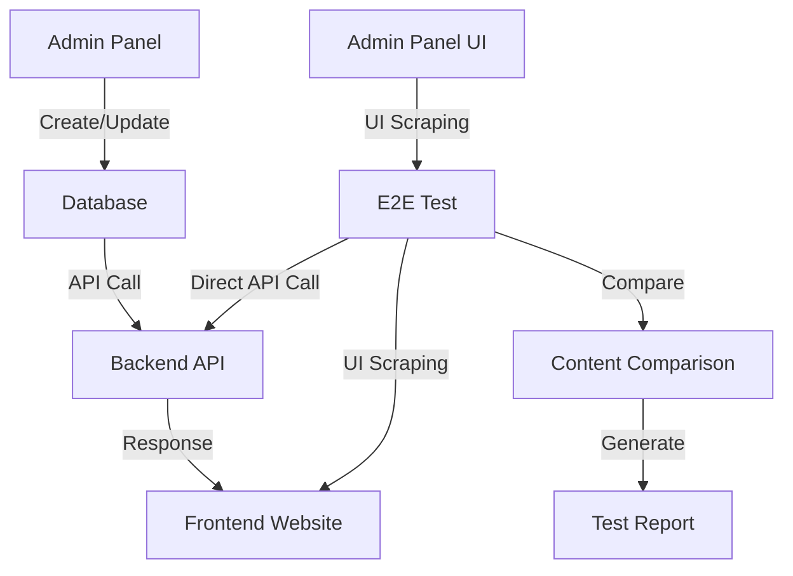

# Seven Boson Group E2E Test Suite Documentation

## Overview

This comprehensive end-to-end test suite ensures data consistency between the Seven Boson Group website and admin panel, verifying that content managed through the admin interface accurately reflects on the public website.

## Architecture

### System Components Tested
- **Frontend Website**: React/TypeScript application (http://localhost:5174)
- **Admin Panel**: React admin interface (http://localhost:3002)  
- **Backend API**: Node.js/Express API server (http://localhost:5001)
- **Database**: PostgreSQL database with CMS content

### Test Framework
- **Playwright**: Modern browser automation framework
- **TypeScript**: Type-safe test development
- **Multi-browser**: Chrome, Firefox, Safari testing
- **Parallel Execution**: Fast test execution
- **Rich Reporting**: HTML reports with screenshots/videos

## Test Suites

### 1. Content Consistency Tests (`content-consistency.spec.ts`)

**Purpose**: Verify that website content matches admin panel/database content exactly.

**Test Coverage**:
- ✅ **Team Page Hero Content**: Title, description, background image
- ✅ **Team Members Data**: Name, title, experience, education, contact info
- ✅ **Portfolio Page Hero Content**: Dynamic page content from CMS
- ✅ **Portfolio Companies**: Company details, descriptions, sectors
- ✅ **Homepage Investment Pillars**: Dynamic investment focus areas
- ✅ **Admin Panel Data Integrity**: Admin interface shows same data as API

**How It Works**:
```typescript
// 1. Fetch data directly from API
const apiTeamMembers = await apiHelper.getTeamMembers();

// 2. Extract data from website UI
const uiTeamMembers = await page.$$eval('[data-testid="team-member"]', (elements) => {
  return elements.map(el => ({
    name: el.querySelector('h3')?.textContent?.trim(),
    title: el.querySelector('[data-testid="member-title"]')?.textContent?.trim()
  }));
});

// 3. Compare data point by point
const comparison = ContentComparator.compareTeamMember(apiMember, uiMember);

// 4. Generate detailed report
const report = ContentComparator.generateReport(comparisons, 'Team Members');
```

### 2. CRUD Operations Tests (`crud-operations.spec.ts`)

**Purpose**: Verify create, read, update, delete operations work correctly across the entire system.

**Test Coverage**:
- ✅ **Team Member CRUD**: Create → Verify in DB → Update → Verify → Delete → Verify
- ✅ **Portfolio Company CRUD**: Full lifecycle testing
- ✅ **Real-time Sync**: Admin changes immediately reflect on website
- ✅ **Data Validation**: Proper form validation and error handling
- ✅ **Authentication**: Secure admin access verification

**Test Flow Example**:
```typescript
// 1. Create via admin panel
await page.click('button:has-text("Add Team Member")');
await page.fill('input[name="name"]', testMember.name);
await page.click('button:has-text("Create")');

// 2. Verify in database
const updatedMembers = await apiHelper.getTeamMembers();
const createdMember = updatedMembers.find(member => member.name === testMember.name);
expect(createdMember).toBeDefined();

// 3. Update via admin panel
await page.click('button[aria-label="Edit"]');
await page.fill('input[name="title"]', updatedTitle);
await page.click('button:has-text("Update")');

// 4. Verify update in database
const members = await apiHelper.getTeamMembers();
const updatedMember = members.find(member => member.id === testMemberId);
expect(updatedMember.title).toBe(updatedTitle);
```

### 3. Performance & Reliability Tests (`performance-reliability.spec.ts`)

**Purpose**: Ensure the system performs well and handles edge cases gracefully.

**Test Coverage**:
- ✅ **API Response Times**: All endpoints respond within 2-3 seconds
- ✅ **Page Load Performance**: Website pages load within 5 seconds
- ✅ **Data Consistency Under Load**: Multiple simultaneous requests return identical data
- ✅ **Error Handling**: Graceful degradation when APIs fail
- ✅ **Data Integrity**: No duplicates, all required fields populated
- ✅ **Cross-browser Compatibility**: Consistent behavior across browsers

**Performance Benchmarks**:
```typescript
const endpoints = [
  { name: 'Team Members', endpoint: '/team', maxTime: 2000 },
  { name: 'Portfolio Companies', endpoint: '/portfolio', maxTime: 2000 },
  { name: 'Homepage Content', endpoint: '/homepage', maxTime: 3000 }
];

// Measure response times
const startTime = Date.now();
const response = await fetch(`http://localhost:5001/api${endpoint.endpoint}`);
const duration = Date.now() - startTime;

expect(duration).toBeLessThanOrEqual(endpoint.maxTime);
```

## Key Features

### 1. Data Consistency Verification

**Content Comparison Engine**:
```typescript
class ContentComparator {
  static compareTeamMember(apiMember, uiData) {
    return {
      name: apiMember.name === uiData.name,
      title: apiMember.title === uiData.title,
      experience: apiMember.experience === uiData.experience
    };
  }
}
```

### 2. API Testing Utilities

**Direct Database Verification**:
```typescript
class APIHelper {
  async getTeamMembers() {
    const response = await fetch(`${this.baseURL}/team`);
    return response.json();
  }
  
  async authenticate() {
    const response = await fetch(`${this.baseURL}/auth/login`, {
      method: 'POST',
      body: JSON.stringify({ email: 'admin@sevenboson.com', password: 'admin123' })
    });
    return response.json().token;
  }
}
```

### 3. Test Data Management

**Automated Test Data Creation/Cleanup**:
```typescript
class TestDataManager {
  static createTestTeamMember() {
    return {
      name: `Test Member ${Date.now()}`,
      title: 'Test Manager, 7Boson',
      experience: 'Test experience for E2E verification',
      position: 999
    };
  }
}
```

## Test Execution

### Prerequisites
1. **Services Running**:
   - Backend API: `cd backend && npm start` (port 5001)
   - Frontend: `cd .. && npm run dev` (port 5174)  
   - Admin Panel: `cd admin-panel && npm run dev` (port 3002)

2. **Database Seeded**:
   - Run `cd backend && node scripts/seed.js`
   - Ensure test data exists

### Running Tests

#### Quick Start
```bash
cd e2e-tests
./run-tests.sh
```

#### Individual Test Suites
```bash
# Content consistency only
./run-tests.sh content

# CRUD operations only  
./run-tests.sh crud

# Performance tests only
./run-tests.sh performance

# View last report
./run-tests.sh report
```

#### Manual Playwright Commands
```bash
# Install dependencies
npm install
npx playwright install

# Run all tests
npx playwright test

# Run with UI mode
npx playwright test --ui

# Run specific test file
npx playwright test content-consistency.spec.ts

# Generate HTML report
npx playwright show-report
```

### Test Configuration

**Browser Support** (`playwright.config.ts`):
```typescript
projects: [
  { name: 'chromium', use: { ...devices['Desktop Chrome'] } },
  { name: 'firefox', use: { ...devices['Desktop Firefox'] } },
  { name: 'webkit', use: { ...devices['Desktop Safari'] } }
]
```

**Service Management**:
```typescript
webServer: [
  { command: 'cd .. && npm run dev', port: 5174 },
  { command: 'cd ../admin-panel && npm run dev', port: 3002 },
  { command: 'cd ../backend && npm start', port: 5001 }
]
```

## Reports and Monitoring

### HTML Reports
- **Location**: `playwright-report/index.html`
- **Features**: Screenshots, videos, timeline, trace viewer
- **Automatic**: Generated after each test run

### JSON Reports
- **File**: `test-results.json`
- **Purpose**: Machine-readable results for CI/CD integration
- **Format**: Standard Playwright JSON format

### Custom Reports
- **Summary**: Generated in `test-reports/{timestamp}/summary.md`
- **Details**: Performance metrics, comparison results
- **Archives**: Historical test results preserved

## Data Flow Verification

### How Content Consistency is Verified



### Test Data Path
1. **Admin Panel Input**: User creates/edits content via admin interface
2. **Database Storage**: Data persisted in PostgreSQL
3. **API Retrieval**: Backend serves data via REST API
4. **Frontend Display**: React components render data from API
5. **Test Verification**: E2E tests compare all layers

## Common Issues and Troubleshooting

### Test Failures

**Services Not Running**:
```bash
# Check if services are up
curl http://localhost:5001/api/team
curl http://localhost:5174
curl http://localhost:3002
```

**Authentication Issues**:
```bash
# Verify admin credentials
curl -X POST http://localhost:5001/api/auth/login \
  -H "Content-Type: application/json" \
  -d '{"email":"admin@sevenboson.com","password":"admin123"}'
```

**Data Inconsistencies**:
```bash
# Re-seed database
cd backend && node scripts/seed.js
```

### Performance Issues

**Slow API Responses**:
- Check database connection
- Monitor API logs
- Verify no hanging requests

**Page Load Timeouts**:
- Increase timeout values in test config
- Check browser console for errors
- Verify all assets load properly

## CI/CD Integration

### GitHub Actions Example
```yaml
name: E2E Tests
on: [push, pull_request]

jobs:
  e2e-tests:
    runs-on: ubuntu-latest
    steps:
      - uses: actions/checkout@v3
      - uses: actions/setup-node@v3
        with:
          node-version: '18'
      
      - name: Install dependencies
        run: |
          cd e2e-tests
          npm install
          npx playwright install
      
      - name: Run E2E tests
        run: |
          cd e2e-tests
          ./run-tests.sh
      
      - name: Upload test reports
        uses: actions/upload-artifact@v3
        if: always()
        with:
          name: playwright-report
          path: e2e-tests/playwright-report/
```

## Best Practices

### Test Writing
1. **Use Data Attributes**: `data-testid` for reliable element selection
2. **Wait for Network**: `page.waitForLoadState('networkidle')`
3. **Cleanup**: Remove test data after tests
4. **Assertions**: Clear, descriptive error messages

### Data Management
1. **Unique Test Data**: Use timestamps to avoid conflicts
2. **Cleanup**: Always clean up test data
3. **Isolation**: Tests should not depend on each other
4. **Realistic Data**: Use data similar to production

### Performance
1. **Parallel Tests**: Run tests in parallel when possible
2. **Selective Testing**: Target specific areas when debugging
3. **Timeouts**: Set appropriate timeout values
4. **Resource Management**: Close browsers and clean up

## Maintenance

### Regular Tasks
1. **Update Dependencies**: Keep Playwright and test tools updated
2. **Review Timeouts**: Adjust based on performance changes
3. **Add New Tests**: Cover new features as they're added
4. **Monitor Reports**: Regular review of test results

### When to Update Tests
1. **UI Changes**: Update selectors when UI changes
2. **API Changes**: Update API calls when endpoints change
3. **New Features**: Add tests for new functionality
4. **Performance Changes**: Adjust timeout expectations

This test suite provides comprehensive verification that the Seven Boson Group website and admin panel maintain perfect data consistency, ensuring a reliable content management experience.